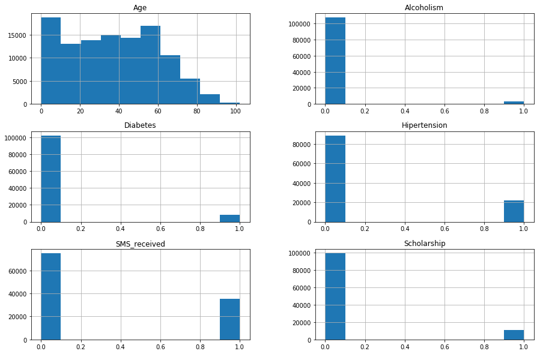
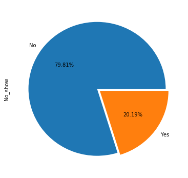
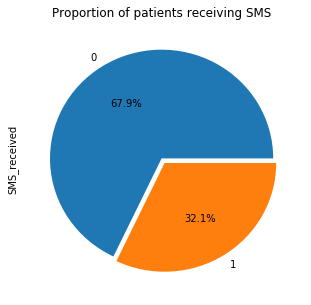
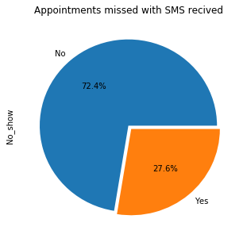
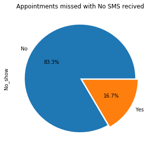

# No-Show-Appointments-Dataset-Investigation
# Project: Investigate a Dataset (No-show appointments)

## Table of Contents
<ul>
<li><a href="#intro">Introduction</a></li>
<li><a href="#wrangling">Data Wrangling</a></li>
<li><a href="#eda">Exploratory Data Analysis</a></li>
<li><a href="#conclusions">Conclusions</a></li>
</ul>

<a id='intro'></a>
## Introduction

> This dataset collects information from 100k medical appointments in Brazil and is focused on the question of whether or not patients show up for their appointment. A number of characteristics about the patient are included in each row.

#### Question 1: Is there relation between SMS received and miss apperment?
#### Question 2: Which part of the day is more appointment attendance?
#### Question 3: Which Age Category is more appointment attendance?


```python
# Use this cell to set up import statements for all of the packages that you
#   plan to use.
import pandas as pd
import numpy as np 
import matplotlib.pyplot as plt
%matplotlib inline
import requests
import io as io


```

<a id='wrangling'></a>
## Data Wrangling


### General Properties


```python
# Load the data from URL
#df = pd.read_csv("noshowappointments-kagglev2-may-2016.csv") can not read file
# asign url file location from the downloaded 'csv' file
url='http://d17h27t6h515a5.cloudfront.net/topher/2017/October/59dd2e9a_noshowappointments-kagglev2-may-2016/noshowappointments-kagglev2-may-2016.csv'
# make a requist to get url file content
rq=requests.get(url).content
# read the 'csv' file from the url and its decode type
df=pd.read_csv(io.StringIO(rq.decode('utf-8')))
```


```python
# print out a few lines.
df.head()
```


<div>
<style scoped>
    .dataframe tbody tr th:only-of-type {
        vertical-align: middle;
    }

    .dataframe tbody tr th {
        vertical-align: top;
    }

    .dataframe thead th {
        text-align: right;
    }
</style>
<table border="1" class="dataframe">
  <thead>
    <tr style="text-align: right;">
      <th></th>
      <th>PatientId</th>
      <th>AppointmentID</th>
      <th>Gender</th>
      <th>ScheduledDay</th>
      <th>AppointmentDay</th>
      <th>Age</th>
      <th>Neighbourhood</th>
      <th>Scholarship</th>
      <th>Hipertension</th>
      <th>Diabetes</th>
      <th>Alcoholism</th>
      <th>Handcap</th>
      <th>SMS_received</th>
      <th>No-show</th>
    </tr>
  </thead>
  <tbody>
    <tr>
      <th>0</th>
      <td>2.987250e+13</td>
      <td>5642903</td>
      <td>F</td>
      <td>2016-04-29T18:38:08Z</td>
      <td>2016-04-29T00:00:00Z</td>
      <td>62</td>
      <td>JARDIM DA PENHA</td>
      <td>0</td>
      <td>1</td>
      <td>0</td>
      <td>0</td>
      <td>0</td>
      <td>0</td>
      <td>No</td>
    </tr>
    <tr>
      <th>1</th>
      <td>5.589978e+14</td>
      <td>5642503</td>
      <td>M</td>
      <td>2016-04-29T16:08:27Z</td>
      <td>2016-04-29T00:00:00Z</td>
      <td>56</td>
      <td>JARDIM DA PENHA</td>
      <td>0</td>
      <td>0</td>
      <td>0</td>
      <td>0</td>
      <td>0</td>
      <td>0</td>
      <td>No</td>
    </tr>
    <tr>
      <th>2</th>
      <td>4.262962e+12</td>
      <td>5642549</td>
      <td>F</td>
      <td>2016-04-29T16:19:04Z</td>
      <td>2016-04-29T00:00:00Z</td>
      <td>62</td>
      <td>MATA DA PRAIA</td>
      <td>0</td>
      <td>0</td>
      <td>0</td>
      <td>0</td>
      <td>0</td>
      <td>0</td>
      <td>No</td>
    </tr>
    <tr>
      <th>3</th>
      <td>8.679512e+11</td>
      <td>5642828</td>
      <td>F</td>
      <td>2016-04-29T17:29:31Z</td>
      <td>2016-04-29T00:00:00Z</td>
      <td>8</td>
      <td>PONTAL DE CAMBURI</td>
      <td>0</td>
      <td>0</td>
      <td>0</td>
      <td>0</td>
      <td>0</td>
      <td>0</td>
      <td>No</td>
    </tr>
    <tr>
      <th>4</th>
      <td>8.841186e+12</td>
      <td>5642494</td>
      <td>F</td>
      <td>2016-04-29T16:07:23Z</td>
      <td>2016-04-29T00:00:00Z</td>
      <td>56</td>
      <td>JARDIM DA PENHA</td>
      <td>0</td>
      <td>1</td>
      <td>1</td>
      <td>0</td>
      <td>0</td>
      <td>0</td>
      <td>No</td>
    </tr>
  </tbody>
</table>
</div>


```python
# Know no of row and columns
df.shape
```


    (110527, 14)


```python
#Perform operations to inspect data types
df.info()
```

    <class 'pandas.core.frame.DataFrame'>
    RangeIndex: 110527 entries, 0 to 110526
    Data columns (total 14 columns):
    PatientId         110527 non-null float64
    AppointmentID     110527 non-null int64
    Gender            110527 non-null object
    ScheduledDay      110527 non-null object
    AppointmentDay    110527 non-null object
    Age               110527 non-null int64
    Neighbourhood     110527 non-null object
    Scholarship       110527 non-null int64
    Hipertension      110527 non-null int64
    Diabetes          110527 non-null int64
    Alcoholism        110527 non-null int64
    Handcap           110527 non-null int64
    SMS_received      110527 non-null int64
    No-show           110527 non-null object
    dtypes: float64(1), int64(8), object(5)
    memory usage: 11.8+ MB


The ouput shows that there are 110527 entries described by 14 fields.<br>
There are no null fields.


```python
#Overall Unique Columns (int64 type)
for column in df.iloc[:,np.r_[2,5:14]].columns:
    print("{}:\n{}".format(column,df[column].unique()))
```

    Gender:
    ['F' 'M']
    Age:
    [ 62  56   8  76  23  39  21  19  30  29  22  28  54  15  50  40  46   4
      13  65  45  51  32  12  61  38  79  18  63  64  85  59  55  71  49  78
      31  58  27   6   2  11   7   0   3   1  69  68  60  67  36  10  35  20
      26  34  33  16  42   5  47  17  41  44  37  24  66  77  81  70  53  75
      73  52  74  43  89  57  14   9  48  83  72  25  80  87  88  84  82  90
      94  86  91  98  92  96  93  95  97 102 115 100  99  -1]
    Neighbourhood:
    ['JARDIM DA PENHA' 'MATA DA PRAIA' 'PONTAL DE CAMBURI' 'REPÚBLICA'
     'GOIABEIRAS' 'ANDORINHAS' 'CONQUISTA' 'NOVA PALESTINA' 'DA PENHA'
     'TABUAZEIRO' 'BENTO FERREIRA' 'SÃO PEDRO' 'SANTA MARTHA' 'SÃO CRISTÓVÃO'
     'MARUÍPE' 'GRANDE VITÓRIA' 'SÃO BENEDITO' 'ILHA DAS CAIEIRAS'
     'SANTO ANDRÉ' 'SOLON BORGES' 'BONFIM' 'JARDIM CAMBURI' 'MARIA ORTIZ'
     'JABOUR' 'ANTÔNIO HONÓRIO' 'RESISTÊNCIA' 'ILHA DE SANTA MARIA'
     'JUCUTUQUARA' 'MONTE BELO' 'MÁRIO CYPRESTE' 'SANTO ANTÔNIO' 'BELA VISTA'
     'PRAIA DO SUÁ' 'SANTA HELENA' 'ITARARÉ' 'INHANGUETÁ' 'UNIVERSITÁRIO'
     'SÃO JOSÉ' 'REDENÇÃO' 'SANTA CLARA' 'CENTRO' 'PARQUE MOSCOSO' 'DO MOSCOSO'
     'SANTOS DUMONT' 'CARATOÍRA' 'ARIOVALDO FAVALESSA' 'ILHA DO FRADE'
     'GURIGICA' 'JOANA D´ARC' 'CONSOLAÇÃO' 'PRAIA DO CANTO' 'BOA VISTA'
     'MORADA DE CAMBURI' 'SANTA LUÍZA' 'SANTA LÚCIA' 'BARRO VERMELHO'
     'ESTRELINHA' 'FORTE SÃO JOÃO' 'FONTE GRANDE' 'ENSEADA DO SUÁ'
     'SANTOS REIS' 'PIEDADE' 'JESUS DE NAZARETH' 'SANTA TEREZA' 'CRUZAMENTO'
     'ILHA DO PRÍNCIPE' 'ROMÃO' 'COMDUSA' 'SANTA CECÍLIA' 'VILA RUBIM'
     'DE LOURDES' 'DO QUADRO' 'DO CABRAL' 'HORTO' 'SEGURANÇA DO LAR'
     'ILHA DO BOI' 'FRADINHOS' 'NAZARETH' 'AEROPORTO'
     'ILHAS OCEÂNICAS DE TRINDADE' 'PARQUE INDUSTRIAL']
    Scholarship:
    [0 1]
    Hipertension:
    [1 0]
    Diabetes:
    [0 1]
    Alcoholism:
    [0 1]
    Handcap:
    [0 1 2 3 4]
    SMS_received:
    [0 1]
    No-show:
    ['No' 'Yes']


```python
#Look for instances of missing or possibly errant data.
#descriptive statistic
df.describe()
```


<div>
<style scoped>
    .dataframe tbody tr th:only-of-type {
        vertical-align: middle;
    }

    .dataframe tbody tr th {
        vertical-align: top;
    }

    .dataframe thead th {
        text-align: right;
    }
</style>
<table border="1" class="dataframe">
  <thead>
    <tr style="text-align: right;">
      <th></th>
      <th>PatientId</th>
      <th>AppointmentID</th>
      <th>Age</th>
      <th>Scholarship</th>
      <th>Hipertension</th>
      <th>Diabetes</th>
      <th>Alcoholism</th>
      <th>Handcap</th>
      <th>SMS_received</th>
    </tr>
  </thead>
  <tbody>
    <tr>
      <th>count</th>
      <td>1.105270e+05</td>
      <td>1.105270e+05</td>
      <td>110527.000000</td>
      <td>110527.000000</td>
      <td>110527.000000</td>
      <td>110527.000000</td>
      <td>110527.000000</td>
      <td>110527.000000</td>
      <td>110527.000000</td>
    </tr>
    <tr>
      <th>mean</th>
      <td>1.474963e+14</td>
      <td>5.675305e+06</td>
      <td>37.088874</td>
      <td>0.098266</td>
      <td>0.197246</td>
      <td>0.071865</td>
      <td>0.030400</td>
      <td>0.022248</td>
      <td>0.321026</td>
    </tr>
    <tr>
      <th>std</th>
      <td>2.560949e+14</td>
      <td>7.129575e+04</td>
      <td>23.110205</td>
      <td>0.297675</td>
      <td>0.397921</td>
      <td>0.258265</td>
      <td>0.171686</td>
      <td>0.161543</td>
      <td>0.466873</td>
    </tr>
    <tr>
      <th>min</th>
      <td>3.921784e+04</td>
      <td>5.030230e+06</td>
      <td>-1.000000</td>
      <td>0.000000</td>
      <td>0.000000</td>
      <td>0.000000</td>
      <td>0.000000</td>
      <td>0.000000</td>
      <td>0.000000</td>
    </tr>
    <tr>
      <th>25%</th>
      <td>4.172614e+12</td>
      <td>5.640286e+06</td>
      <td>18.000000</td>
      <td>0.000000</td>
      <td>0.000000</td>
      <td>0.000000</td>
      <td>0.000000</td>
      <td>0.000000</td>
      <td>0.000000</td>
    </tr>
    <tr>
      <th>50%</th>
      <td>3.173184e+13</td>
      <td>5.680573e+06</td>
      <td>37.000000</td>
      <td>0.000000</td>
      <td>0.000000</td>
      <td>0.000000</td>
      <td>0.000000</td>
      <td>0.000000</td>
      <td>0.000000</td>
    </tr>
    <tr>
      <th>75%</th>
      <td>9.439172e+13</td>
      <td>5.725524e+06</td>
      <td>55.000000</td>
      <td>0.000000</td>
      <td>0.000000</td>
      <td>0.000000</td>
      <td>0.000000</td>
      <td>0.000000</td>
      <td>1.000000</td>
    </tr>
    <tr>
      <th>max</th>
      <td>9.999816e+14</td>
      <td>5.790484e+06</td>
      <td>115.000000</td>
      <td>1.000000</td>
      <td>1.000000</td>
      <td>1.000000</td>
      <td>1.000000</td>
      <td>4.000000</td>
      <td>1.000000</td>
    </tr>
  </tbody>
</table>
</div>


```python
# count # of unique patient and appointment IDs 
df.loc[:, ['PatientId', 'AppointmentID']].nunique()
```


    PatientId         62299
    AppointmentID    110527
    dtype: int64


##### AppointmentID    is unique <br>but PaientId is not i.e. patient may be showed more than 1

### Dataset Field: meanning, value range, possible error data:

   <ul>
    <li><b>PatienId</b>      : Patient Identification number.<BR>           (not uniqe-repeated value)</li>
<li><b>AppointmentID</b> : Appointment Identification.                  (uniqe), may index on it <BR>         rename it  (AppointmentID ==> AppointmentId)</li>
<li><b>Gender     </b>   : Patient gender - Male/Female (M/F). </li>
<li><b>ScheduledDay  </b>: Tells us on what day and time the patient set up their appointment.<br>            [but it is not in right format 'date']<br>             and we need week day name to analyze on it<br>            we may get the time value and convert it to (morning /afternoon/evening) and analyze it</li>
<li><b>Age</b>           : Patient Age.<br>            (But there is -ve value '-1')<br>             If age is in age ranges it will be useful and may analyzed</li>
<li><b>AppointmentDay</b>: Appointment date <br>            [but it is not in right format 'date']</li>
<li><b>Neighbourhood</b> : Name of the nearest hospital location to the patient </li>
<li><b>Scholarship</b>   : Is the patient receives a scholarship? (0/1)</li>
<li><b>Hipertension</b>  : Is the patient has hypertension? (0/1)</li>
<li><b>Diabetes   </b>   : Is the patient has diabetes? (0/1)</li>
<li><b>Alcoholism    </b>: Is the patient alcoholic? (0/1)    </li>
<li><b>Handcap     </b>  : The # of patient handicap (0,1,2,3,4)               rename it  Handcap ==> handicap  </li>
<li><b>SMS_received </b> : Is message sent to the patient? (0/1)    </li>
<li><b>No-show     </b>  : Is the patient not showed up to their appointment day? (Yes/No) <br>            [ 'No' mean patient showed up, 'Yes' mean patient did not show up.]<br>            we may convert its  to INT to appere in all statistics
    <br>            and rename it  (No-Show ==> No_Show)</li></ul>


### Data Cleaning


```python
# After discussing the structure of the data and any problems that need to be
#   cleaned, perform those cleaning steps in the second part of this section.

```

The youngest person '-1' and the oldest '115' are outliers in the Age field that could potentially be errors.


```python
#Remove Age <0 '-1'
df.drop(index=df[df.Age ==-1].index, inplace=True)
```


```python
#Remove Age '115'
df.drop(index=df[df.Age ==115].index, inplace=True)
```


```python
#change dated columes to type date 
df['ScheduledDay'] = pd.to_datetime(df['ScheduledDay'])
df['AppointmentDay'] = pd.to_datetime(df['AppointmentDay']) 
```


```python
#Rename columns (AppointmentID, Handcap, No-show)
df.rename(
    columns = {'AppointmentID':'AppointmentId', 
                     'Handcap':'Handicap', 
                     'No-show':'No_show'},
    inplace = True)
```


```python
#convert column 'No_show' to int type 
#df['No_show'] = (df.No_show == "Yes").astype(int) 
```


```python
# Create a function that convert datetime (dt) to its Week Day Nname:
day_from_datetime = lambda dt:  dt.weekday_name 
# Apply the function to the AppointmentDay column 
df['DayOfWeek'] = df.AppointmentDay.apply(day_from_datetime) 

df.DayOfWeek.value_counts().to_frame(name='Number of Appointments') 
```

    /opt/conda/lib/python3.6/site-packages/ipykernel_launcher.py:2: FutureWarning: `weekday_name` is deprecated and will be removed in a future version. Use `day_name` instead
      


<div>
<style scoped>
    .dataframe tbody tr th:only-of-type {
        vertical-align: middle;
    }

    .dataframe tbody tr th {
        vertical-align: top;
    }

    .dataframe thead th {
        text-align: right;
    }
</style>
<table border="1" class="dataframe">
  <thead>
    <tr style="text-align: right;">
      <th></th>
      <th>Number of Appointments</th>
    </tr>
  </thead>
  <tbody>
    <tr>
      <th>Wednesday</th>
      <td>25867</td>
    </tr>
    <tr>
      <th>Tuesday</th>
      <td>25640</td>
    </tr>
    <tr>
      <th>Monday</th>
      <td>22712</td>
    </tr>
    <tr>
      <th>Friday</th>
      <td>19018</td>
    </tr>
    <tr>
      <th>Thursday</th>
      <td>17245</td>
    </tr>
    <tr>
      <th>Saturday</th>
      <td>39</td>
    </tr>
  </tbody>
</table>
</div>


Wednesday, and Tuesday were the most higher days for appointments, followed by Monday, Friday, and Thursday. Saturday was the lowest with 39 appointments.


```python
#create a function to get part of day from date time 
def TimeCat (Time1):
    Time1 = int(Time1.hour)   
    if    Time1 <  12 :        return 'Morning'
    elif  Time1 >= 18 :        return 'Evening'
    elif  Time1 >= 12 :        return 'Afternoon'
#create a column to show the part of day from ScheduledDay 
df['Part_day'] = df.ScheduledDay.apply(TimeCat)
```


```python
df.Part_day.value_counts().to_frame(name='Number of Appointments') 
```


<div>
<style scoped>
    .dataframe tbody tr th:only-of-type {
        vertical-align: middle;
    }

    .dataframe tbody tr th {
        vertical-align: top;
    }

    .dataframe thead th {
        text-align: right;
    }
</style>
<table border="1" class="dataframe">
  <thead>
    <tr style="text-align: right;">
      <th></th>
      <th>Number of Appointments</th>
    </tr>
  </thead>
  <tbody>
    <tr>
      <th>Morning</th>
      <td>68476</td>
    </tr>
    <tr>
      <th>Afternoon</th>
      <td>40114</td>
    </tr>
    <tr>
      <th>Evening</th>
      <td>1931</td>
    </tr>
  </tbody>
</table>
</div>


Morning was the most higher day part for appointments, followed by Afternoon. Evening was the lowest with 1931 appointments.


```python
#create a function to age Category 
def AgeCat (Age1):   
    if Age1 < 31:        return 'young'
    elif Age1 < 61 :        return 'Man'
    else:        return 'Old' 
#create a column to show age Category 
df['Age_Cat'] = df.Age.apply(AgeCat)
```


```python
df.Age_Cat.value_counts().to_frame(name='Number of Appointments') 
```


<div>
<style scoped>
    .dataframe tbody tr th:only-of-type {
        vertical-align: middle;
    }

    .dataframe tbody tr th {
        vertical-align: top;
    }

    .dataframe thead th {
        text-align: right;
    }
</style>
<table border="1" class="dataframe">
  <thead>
    <tr style="text-align: right;">
      <th></th>
      <th>Number of Appointments</th>
    </tr>
  </thead>
  <tbody>
    <tr>
      <th>young</th>
      <td>45631</td>
    </tr>
    <tr>
      <th>Man</th>
      <td>45133</td>
    </tr>
    <tr>
      <th>Old</th>
      <td>19757</td>
    </tr>
  </tbody>
</table>
</div>


'young' was the most higher Age Category part for appointments, followed by 'Man' and 'Old' was the lowest with 19762 appointments.


```python
#df.info()
df.head()
```


<div>
<style scoped>
    .dataframe tbody tr th:only-of-type {
        vertical-align: middle;
    }

    .dataframe tbody tr th {
        vertical-align: top;
    }

    .dataframe thead th {
        text-align: right;
    }
</style>
<table border="1" class="dataframe">
  <thead>
    <tr style="text-align: right;">
      <th></th>
      <th>PatientId</th>
      <th>AppointmentId</th>
      <th>Gender</th>
      <th>ScheduledDay</th>
      <th>AppointmentDay</th>
      <th>Age</th>
      <th>Neighbourhood</th>
      <th>Scholarship</th>
      <th>Hipertension</th>
      <th>Diabetes</th>
      <th>Alcoholism</th>
      <th>Handicap</th>
      <th>SMS_received</th>
      <th>No_show</th>
      <th>DayOfWeek</th>
      <th>Part_day</th>
      <th>Age_Cat</th>
    </tr>
  </thead>
  <tbody>
    <tr>
      <th>0</th>
      <td>2.987250e+13</td>
      <td>5642903</td>
      <td>F</td>
      <td>2016-04-29 18:38:08</td>
      <td>2016-04-29</td>
      <td>62</td>
      <td>JARDIM DA PENHA</td>
      <td>0</td>
      <td>1</td>
      <td>0</td>
      <td>0</td>
      <td>0</td>
      <td>0</td>
      <td>No</td>
      <td>Friday</td>
      <td>Evening</td>
      <td>Old</td>
    </tr>
    <tr>
      <th>1</th>
      <td>5.589978e+14</td>
      <td>5642503</td>
      <td>M</td>
      <td>2016-04-29 16:08:27</td>
      <td>2016-04-29</td>
      <td>56</td>
      <td>JARDIM DA PENHA</td>
      <td>0</td>
      <td>0</td>
      <td>0</td>
      <td>0</td>
      <td>0</td>
      <td>0</td>
      <td>No</td>
      <td>Friday</td>
      <td>Afternoon</td>
      <td>Man</td>
    </tr>
    <tr>
      <th>2</th>
      <td>4.262962e+12</td>
      <td>5642549</td>
      <td>F</td>
      <td>2016-04-29 16:19:04</td>
      <td>2016-04-29</td>
      <td>62</td>
      <td>MATA DA PRAIA</td>
      <td>0</td>
      <td>0</td>
      <td>0</td>
      <td>0</td>
      <td>0</td>
      <td>0</td>
      <td>No</td>
      <td>Friday</td>
      <td>Afternoon</td>
      <td>Old</td>
    </tr>
    <tr>
      <th>3</th>
      <td>8.679512e+11</td>
      <td>5642828</td>
      <td>F</td>
      <td>2016-04-29 17:29:31</td>
      <td>2016-04-29</td>
      <td>8</td>
      <td>PONTAL DE CAMBURI</td>
      <td>0</td>
      <td>0</td>
      <td>0</td>
      <td>0</td>
      <td>0</td>
      <td>0</td>
      <td>No</td>
      <td>Friday</td>
      <td>Afternoon</td>
      <td>young</td>
    </tr>
    <tr>
      <th>4</th>
      <td>8.841186e+12</td>
      <td>5642494</td>
      <td>F</td>
      <td>2016-04-29 16:07:23</td>
      <td>2016-04-29</td>
      <td>56</td>
      <td>JARDIM DA PENHA</td>
      <td>0</td>
      <td>1</td>
      <td>1</td>
      <td>0</td>
      <td>0</td>
      <td>0</td>
      <td>No</td>
      <td>Friday</td>
      <td>Afternoon</td>
      <td>Man</td>
    </tr>
  </tbody>
</table>
</div>


```python
#descriptive statistic 
df.describe()
```


<div>
<style scoped>
    .dataframe tbody tr th:only-of-type {
        vertical-align: middle;
    }

    .dataframe tbody tr th {
        vertical-align: top;
    }

    .dataframe thead th {
        text-align: right;
    }
</style>
<table border="1" class="dataframe">
  <thead>
    <tr style="text-align: right;">
      <th></th>
      <th>PatientId</th>
      <th>AppointmentId</th>
      <th>Age</th>
      <th>Scholarship</th>
      <th>Hipertension</th>
      <th>Diabetes</th>
      <th>Alcoholism</th>
      <th>Handicap</th>
      <th>SMS_received</th>
    </tr>
  </thead>
  <tbody>
    <tr>
      <th>count</th>
      <td>1.105210e+05</td>
      <td>1.105210e+05</td>
      <td>110521.000000</td>
      <td>110521.000000</td>
      <td>110521.000000</td>
      <td>110521.000000</td>
      <td>110521.000000</td>
      <td>110521.000000</td>
      <td>110521.000000</td>
    </tr>
    <tr>
      <th>mean</th>
      <td>1.474921e+14</td>
      <td>5.675304e+06</td>
      <td>37.085694</td>
      <td>0.098271</td>
      <td>0.197248</td>
      <td>0.071869</td>
      <td>0.030401</td>
      <td>0.022213</td>
      <td>0.321034</td>
    </tr>
    <tr>
      <th>std</th>
      <td>2.560928e+14</td>
      <td>7.129576e+04</td>
      <td>23.104606</td>
      <td>0.297682</td>
      <td>0.397923</td>
      <td>0.258272</td>
      <td>0.171690</td>
      <td>0.161440</td>
      <td>0.466876</td>
    </tr>
    <tr>
      <th>min</th>
      <td>3.921784e+04</td>
      <td>5.030230e+06</td>
      <td>0.000000</td>
      <td>0.000000</td>
      <td>0.000000</td>
      <td>0.000000</td>
      <td>0.000000</td>
      <td>0.000000</td>
      <td>0.000000</td>
    </tr>
    <tr>
      <th>25%</th>
      <td>4.172457e+12</td>
      <td>5.640285e+06</td>
      <td>18.000000</td>
      <td>0.000000</td>
      <td>0.000000</td>
      <td>0.000000</td>
      <td>0.000000</td>
      <td>0.000000</td>
      <td>0.000000</td>
    </tr>
    <tr>
      <th>50%</th>
      <td>3.172598e+13</td>
      <td>5.680569e+06</td>
      <td>37.000000</td>
      <td>0.000000</td>
      <td>0.000000</td>
      <td>0.000000</td>
      <td>0.000000</td>
      <td>0.000000</td>
      <td>0.000000</td>
    </tr>
    <tr>
      <th>75%</th>
      <td>9.438963e+13</td>
      <td>5.725523e+06</td>
      <td>55.000000</td>
      <td>0.000000</td>
      <td>0.000000</td>
      <td>0.000000</td>
      <td>0.000000</td>
      <td>0.000000</td>
      <td>1.000000</td>
    </tr>
    <tr>
      <th>max</th>
      <td>9.999816e+14</td>
      <td>5.790484e+06</td>
      <td>102.000000</td>
      <td>1.000000</td>
      <td>1.000000</td>
      <td>1.000000</td>
      <td>1.000000</td>
      <td>4.000000</td>
      <td>1.000000</td>
    </tr>
  </tbody>
</table>
</div>


```python
#variables frequency 
df[['Age','Scholarship','Hipertension','Diabetes','Alcoholism','SMS_received','No_show']].hist(figsize=(15,10))
```


    array([[<matplotlib.axes._subplots.AxesSubplot object at 0x7f174939f240>,
            <matplotlib.axes._subplots.AxesSubplot object at 0x7f1748cdb160>],
           [<matplotlib.axes._subplots.AxesSubplot object at 0x7f17442dc240>,
            <matplotlib.axes._subplots.AxesSubplot object at 0x7f174933c240>],
           [<matplotlib.axes._subplots.AxesSubplot object at 0x7f1748cdd940>,
            <matplotlib.axes._subplots.AxesSubplot object at 0x7f1748cdd9e8>]], dtype=object)





<b>Plot comments:</B><br>
There is a drop down of number of Patient over 60 y,<BR>
There are fewer Patient with alcoholism, diabetes, hypertension, received sms and scholarship.<BR>
There are more Patient who show up for their scheduled appointment.

About 20% of all appointments resulted in no shows. <br>The research questions will attempt to answer if the demographics of these populations are the same. They will also try to answer if this proportion is consistant given serveral priori.

<a id='eda'></a>
## Exploratory Data Analysis


```python
#Plot the proportion of NoShows as a piechart.   Extra parameters are passed to ensure the pie chart is a square,   format the decimal and pop out the second slice for effect.

df.No_show.value_counts().plot.pie(figsize=(6,6), autopct='%.2f%%', explode=(0, .05))
plt.show()
```





### Research Question 1  (Is there relation between SMS received and miss apperment?)


```python
df['SMS_received'].value_counts().plot(kind='pie', autopct='%1.1f%%', title='Proportion of patients receiving SMS', figsize=[5,5], explode=(0, .05))
```


    <matplotlib.axes._subplots.AxesSubplot at 0x7f17491fcf98>





About 32% of patients received SMS reminders,<br> 
the question is: does receiving SMS made patients likely to attend appointments?.


```python
# split data frame into two groups
SMS = df.query('SMS_received == 1')
NoSMS = df.query('SMS_received == 0')
```


```python
# what proportion of appointments were missed by those who received SMS?
SMS['No_show'].value_counts().plot(kind='pie', title='Appointments missed with SMS recived', autopct='%1.1f%%', figsize=[5,5], explode=(0, .05))
```


    <matplotlib.axes._subplots.AxesSubplot at 0x7f1747a30940>





About 27% of patients received SMS reminders and missed appointments


```python
# what proportion of appointments were missed by those who did not received SMS?
NoSMS['No_show'].value_counts().plot(kind='pie', title='Appointments missed with No SMS recived', autopct='%1.1f%%', figsize=[5,5], explode=(0, .05))
```


    <matplotlib.axes._subplots.AxesSubplot at 0x7f1747437438>





About 17% of patients does not receive SMS reminders and missed appointments


```python
# Use this, and more code cells, to explore your data. Don't forget to add
#   Markdown cells to document your observations and findings.

```

### Research Question 2  (Which part of the day is more appointment attendance?)


```python
df.Part_day.value_counts().to_frame(name='Number of Appointments') 
```


<div>
<style scoped>
    .dataframe tbody tr th:only-of-type {
        vertical-align: middle;
    }

    .dataframe tbody tr th {
        vertical-align: top;
    }

    .dataframe thead th {
        text-align: right;
    }
</style>
<table border="1" class="dataframe">
  <thead>
    <tr style="text-align: right;">
      <th></th>
      <th>Number of Appointments</th>
    </tr>
  </thead>
  <tbody>
    <tr>
      <th>Morning</th>
      <td>68476</td>
    </tr>
    <tr>
      <th>Afternoon</th>
      <td>40114</td>
    </tr>
    <tr>
      <th>Evening</th>
      <td>1931</td>
    </tr>
  </tbody>
</table>
</div>


Morning was the most higher day part for appointments, followed by Afternoon. Evening was the lowest with 1931 appointments.


```python
# 
df.Part_day[Show].value_counts().plot(kind='bar', alpha=0.5,color='red', label='Show')
df.Part_day[noshows].value_counts().plot(kind='bar', alpha=0.5, color='blue',label='No-Show')
plt.legend()
plt.title('Day Parts Appointment Attendance')
plt.xlabel('Day Parts')
plt.ylabel('Patient Quantity')
plt.xticks(rotation=0)
```


    ---------------------------------------------------------------------------

    NameError                                 Traceback (most recent call last)

    <ipython-input-60-96805a3435a9> in <module>()
          1 #
    ----> 2 df.Part_day[Show].value_counts().plot(kind='bar', alpha=0.5,color='red', label='Show')
          3 df.Part_day[noshows].value_counts().plot(kind='bar', alpha=0.5, color='blue',label='No-Show')
          4 plt.legend()
          5 plt.title('Day Parts Appointment Attendance')


    NameError: name 'Show' is not defined


the above graph show the comparing between Attendance (Show) and Non attendence (No Show)<BR>
    the next 3 graph show the % of No Show in each Day Part


```python
# split data frame into 3 groups
Morning = df.query('Part_day == "Morning"')
Afternoon = df.query('Part_day == "Afternoon"')
Evening = df.query('Part_day == "Evening"')
```


```python
Morning['No_show'].value_counts().plot(kind='pie', title='Appointments missed in Morning', autopct='%1.1f%%', figsize=[5,5], explode=(0, .05))
```

the attendence (Show) in the morning  is about 81% to no attendence (NO SHow) 19%


```python
Afternoon['No_show'].value_counts().plot(kind='pie', title='Appointments missed in Afternoon', autopct='%1.1f%%', figsize=[5,5], explode=(0, .05))
```

the attendence (Show) in the Afternoon  is about 78% to no attendence (NO SHow) about 22%


```python
Evening['No_show'].value_counts().plot(kind='pie', title='Appointments missed in Evening', autopct='%1.1f%%', figsize=[5,5], explode=(0, .05))
```

the attendence (Show) in the Evening  is about 78% to no attendence (NO SHow) about 22%

### Research Question 3  (Which Age Category is more appointment attendance?)


```python
Show = (df.No_show == 'No')
noshows = (df.No_show == 'Yes') 
df[Show].Age.plot.hist()
df[noshows ].Age.plot.hist()
plt.legend(['Show Apointments', 'No Shows'])
plt.show()
print('Show Appointments Mean Age:{:.2f}'.format(df[Show].Age.mean())) 
print('Missed Appointments Mean Age:{:.2f}'.format(df[noshows].Age.mean())) 
```

This histogram overlays the distributions of Show appointments and Mised (No Show) so that they can be compared. The peak near 60 years is much smaller for no shows. The mean is also lower but is not apparent with a histogram.


So the vast majority of patients are 60 or under. Let's divide our patient population into three groups: young (under 30),  Man (between 30 and less than 60) and old (60 and over).


```python
df.Age_Cat.value_counts().to_frame(name='Number of Appointments') 
```

'young' was the most higher Age Category part for appointments, followed by 'Man' and 'Old' was the lowest with 19762 appointments.

Then we will see if there are differences in the rate at which these groups miss appointments.


```python
young = df.query('Age < 30')
Man   = df.query('Age >= 30 & Age < 60')
old   = df.query('Age >= 60')
```


```python
young['No_show'].value_counts().plot(kind='pie', autopct='%1.1f%%', figsize=[5,5], title='Missed Appointments by Young Patients', explode=(0, .05))
```

the attendence (Show) in the Young is about 77% to no attendence (NO SHow) about 23%


```python
Man['No_show'].value_counts().plot(kind='pie', autopct='%1.1f%%', figsize=[5,5], title='Missed Appointments by Man Patients', explode=(0, .05))
```

the attendence (Show) in the Man is about 80% to no attendence (NO SHow) about 20%


```python
old['No_show'].value_counts().plot(kind='pie', autopct='%1.1f%%', figsize=[5,5], title='Missed Appointments by Old Patients', explode=(0, .05))
```

the attendence (Show) in the Old is about 85% to no attendence (NO SHow) about 15%

<a id='conclusions'></a>
## Conclusions

Our exploration has generated the statistics and graphs allowing us to fulfill the purposes of our investigation. We can see how certain factors affect the likelihood of patients missing their appointments.

#### Is there relation between SMS received and miss apperment?

Only around 32% of patients received an SMS reminder, and to our surprise those who did receive it were more likely to miss an appointment (27.6%) than those who didn’t (16.7%). Perhaps we should consider no longer sending SMS reminders.

#### Which part of the day is more appointment attendance?

Morning was the most higher day part for appointments, followed by Afternoon. Evening was the lowest with 1931 appointments,
the attendence (Show) in the morning  is about 81% to no attendence (NO SHow) 19%,
the attendence (Show) in the Afternoon  is about 78% to no attendence (NO SHow) about 22%,
the attendence (Show) in the Evening is about 78% to no attendence (NO SHow) about 22%.
The data suggests that the morning is higher day part, so morning need enough doctor’s appointments.

#### Which Age Category is more appointment attendance?

Though the vast majority of patients are young (under 30) or Man (between 30 and 60), young people were most likely to miss appointments (22.9%), Old people over 60 were least likely to miss appointments (15.3%), and Man people were in between (19.8%). The data suggests that the older people get, the more diligent they are about keeping doctor’s appointments.

 ### Limitations
 <B><H4>The are many limitations in the Data:</H4></B>
 <ul>
    <li>Most data set variables are categorical , which does not allow a high level of statistical method that can be used to provide correlations etc</li>
<li>The statistics used here are descriptive statistics, not inferential, meaning that any hypotheses or controlled experiments or Inferences can not created With data.</li>
<li>Lot of details for certain factors are not found to draw conclusions. For the SMS received example, the date and time of sending or receiveing SMS that give us that SMS is importent criteria or just neglect it.</li>
<li>In the Age field, we have error like out of range and outliers values which could potentially give low accurate result.</li>
</ul>
